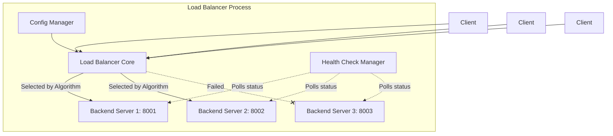
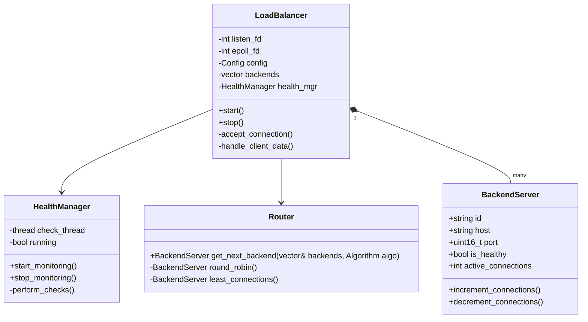
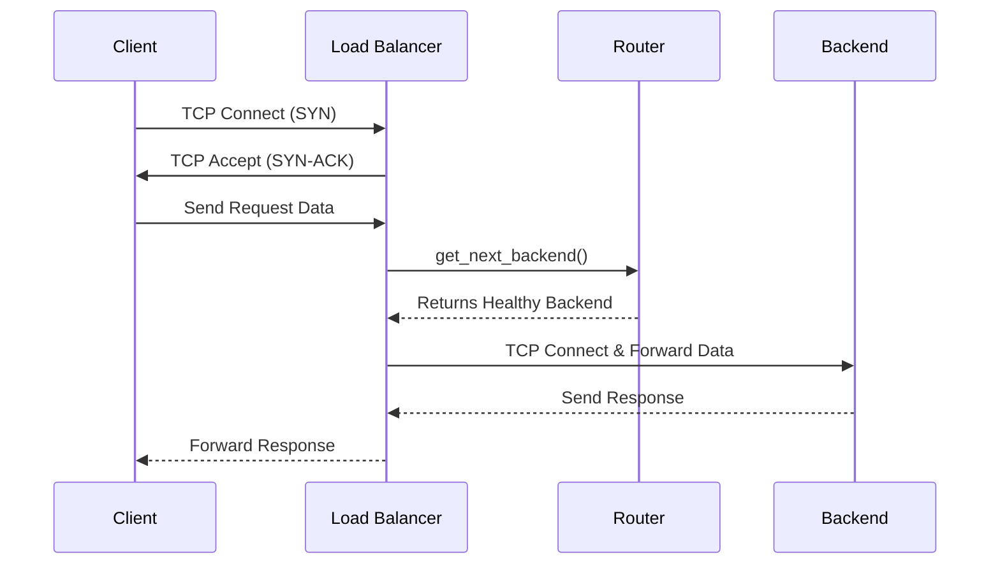
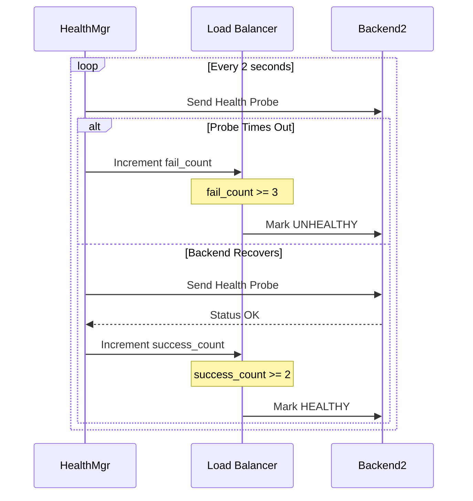
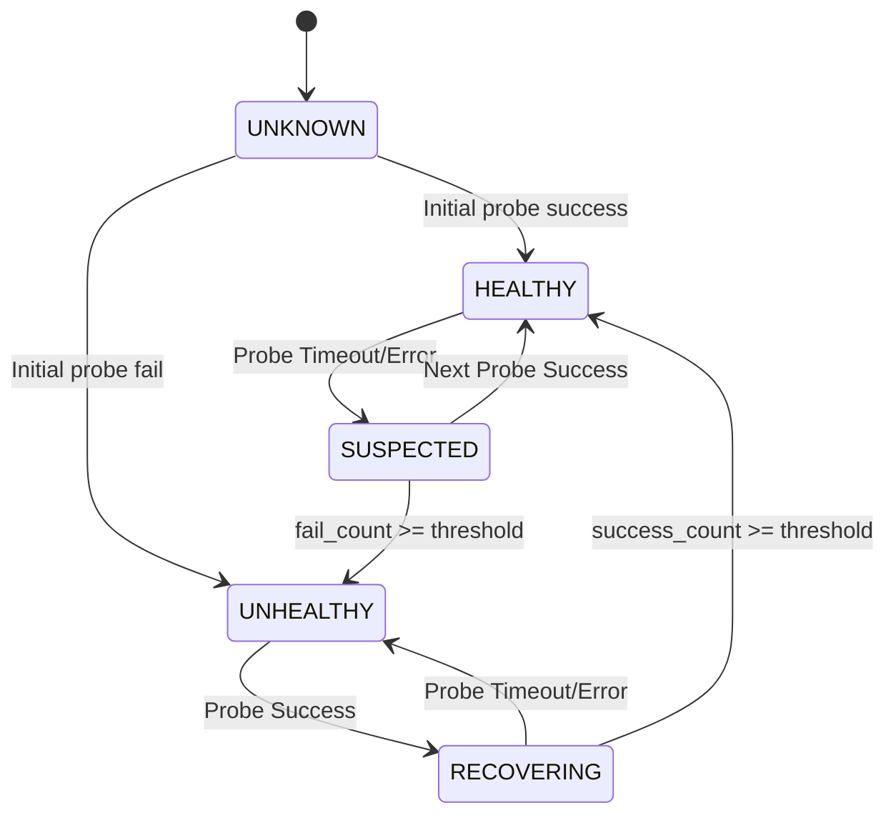

# System UML Diagrams

## 1. Architecture Diagram

## 2. Class Diagram

## 3. Sequence Diagrams

### 3.1 Normal Request Flow

### 3.2 Server Failure & Recovery Flow

## 4. State Machine Diagram (Backend Server)

